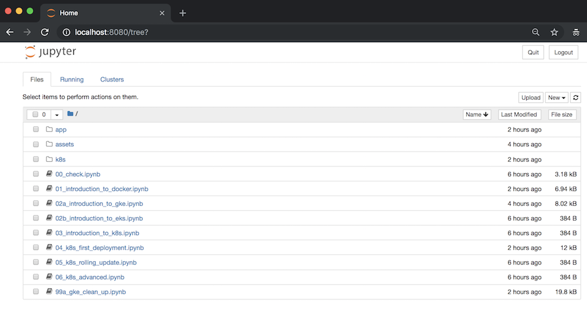
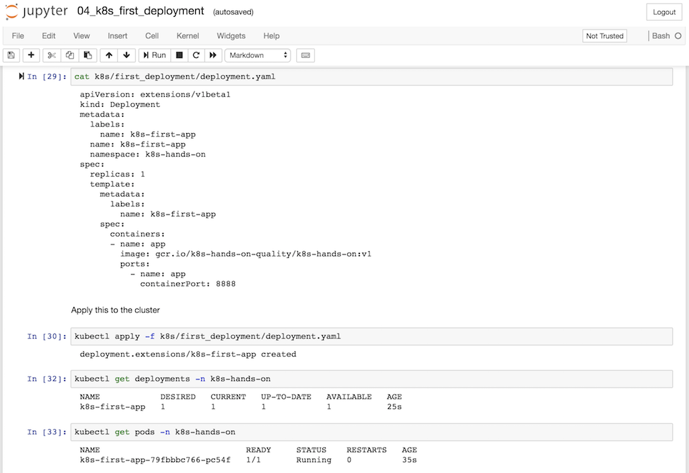

# k8s-hands-on

Interactive Kubernetes Hands-on on Jupyer Notebook





## How to start

### Create volume

```bash
docker volume create k8s-hands-on
```

### Run Container

```bash
docker container run --rm -it \
     -v /var/run/docker.sock:/var/run/docker.sock \
     -v k8s-hands-on:/root/config \
     -p 8080:8080 sakajunquality/k8s-hands-on
```

### Open the Browser

- [http://localhost:8080](http://localhost:8080)
- Password: `sakajunquality`
- follow the instruction on notebooks

## Notebooks

- [00 Environment Check](./notebooks/00_check.ipynb)
- [01 Introduction to Docker](./notebooks/01_introduction_to_docker.ipynb)
- [02-A Introduction to Google Kubernetes Engine (GKE)](./notebooks/02a_introduction_to_gke.ipynb)
- 02-B Introduction to Amazon Elastic Container Service for Kubernetes (EKS)
- 03 Introduction to Kubernetes
- [04 Kubernetes First Deployment](./notebooks/04_k8s_first_deployment.ipynb)
- 05 Kubernetes Rolling Update
- 06 Kubernetes Advanced
- [99-A GKE Clean up](./notebooks/99a_gke_clean_up.ipynb)
- 99-B EKS Clean up

## Clean up

```bash
docker volume rm k8s-hands-on
```
